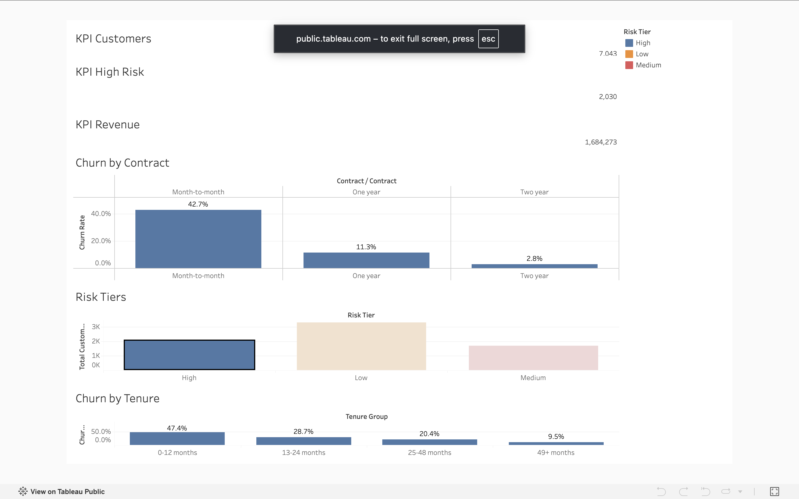

# Customer Churn Prediction & Retention Strategy

**Which customers are likely to leave, why, and who is worth saving?**

An end-to-end project (SQL, Python, XGBoost, SHAP, Tableau) that scores every customer's churn risk, explains the drivers, and estimates the profit of a targeted retention campaign.

**Live dashboard:** [Tableau Public](https://public.tableau.com/app/profile/sarani.wellage/viz/CustomerChurnRetentionDashboard_17909092780700/Dashboard1)



## Headline result

On a held-out test set of 1,057 customers, the final XGBoost model reached **ROC-AUC 0.855** and **PR-AUC 0.665** (base churn rate 26.5%). The top 10% of customers by predicted risk churned at **75%**, a **2.8x lift**. Under stated assumptions, a model-targeted campaign yields an estimated **$45.5K** net benefit versus **$38.8K** for contacting everyone. These are assumption-based estimates, not measured campaign results.

## Business problem

The retention team has a limited budget. The goal is to identify high-risk customers, understand the main factors associated with churn, and target retention offers where they pay off.

**Assumptions (adjustable):** $20 offer cost per contacted customer, 25% offer success rate, 12 months of revenue kept when a customer is saved.

## Data

IBM Telco Customer Churn dataset (7,043 customers, 33 columns, 26.5% churn). The flat file was split into four tables (customers, services, billing, status) in SQLite, then rebuilt into one customer-level table with SQL (CTEs, CASE WHEN, window functions).

**Leakage control:** `Churn Score`, `Churn Reason`, and `Churn Label` were excluded from all features. `CLTV` was also excluded from the model.

## Key EDA findings

1. Month-to-month customers churn at 42.7% versus 2.8% for two-year contracts (about 15x).
2. Customers in their first 12 months churn at 47.4% versus 9.5% after 49+ months (about 5x).
3. Month-to-month customers in their first year are the highest-risk group (51.4%, 1,994 customers).
4. Contract matters more than tenure: month-to-month customers with 49+ months still churn at 26.0% versus 3.3% for two-year contracts.
5. Electronic check users churn at about 45%, more than double other payment methods.
6. Fiber optic customers churn at about 42%, roughly double DSL.
7. Among internet customers, churn falls from 52.2% with no add-ons to 5.3% with all six (an association, not proven cause).

## Customer segments (K-Means, k=4)

Segments were built from behavior only (tenure, charges, add-ons, contract). Churn was not used as an input. k=4 was chosen from the elbow and silhouette plots.

| Segment | Customers | Churn | Monthly revenue lost |
|---|---|---|---|
| Mid-tenure high-bill month-to-month | 2,115 | 38% | $71.6K (41% of segment revenue) |
| New low-spend month-to-month | 2,106 | 40% | $47.4K (49%) |
| Loyal high-value bundle | 1,743 | 11% | $19.8K (13%) |
| Loyal phone-only low-bill | 1,079 | 1% | $0.4K (1.5%) |

The two month-to-month segments account for about 85% of all churned monthly revenue. The segment with the highest churn rate is not the one losing the most money.

## Models (validation set)

| Model | ROC-AUC | PR-AUC | Recall | Precision |
|---|---|---|---|---|
| Baseline (dummy) | 0.500 | 0.265 | 0.000 | 0.000 |
| Logistic Regression | 0.859 | 0.693 | 0.789 | 0.526 |
| Random Forest | 0.853 | 0.674 | 0.721 | 0.529 |
| **XGBoost** | **0.865** | **0.710** | 0.779 | 0.527 |
| XGBoost (tuned) | 0.864 | 0.705 | 0.757 | 0.525 |

Tuning (25 candidates, 5-fold CV) gave no gain over sensible defaults, so the default XGBoost was kept. Logistic Regression came within 1.7 PR-AUC points, suggesting the churn signal is largely linear.

**Test set (final):** ROC-AUC 0.855, PR-AUC 0.665, top-decile lift 2.83x.

Class imbalance was handled with class weights, and all preprocessing sits inside a scikit-learn Pipeline to prevent leakage. Raw probabilities were overconfident, so isotonic calibration was applied (test Brier score 0.1517 to 0.1364).

## Campaign profit analysis

Instead of the default 0.5 threshold, the threshold was chosen to maximize expected profit.

| Strategy (test set) | Net profit |
|---|---|
| No campaign | $0 |
| Contact everyone | $38,814 |
| Model-targeted | $45,484 |

Sensitivity: with a weak offer (10% success, $40 cost), blanket outreach loses $17K on validation data while targeting still earns $5.8K. Targeting matters most when offers are costly or weak.

## What drives churn (SHAP)

Top drivers: month-to-month contract, short tenure, no dependents, fiber optic, and high billing. SHAP describes what drives the model's predictions, not proven causes.

| Driver | Retention action |
|---|---|
| Month-to-month contract | Discount or perk for a 12-month contract |
| Short tenure | Onboarding program, 30/90-day check-ins |
| No dependents / no partner | Individual plans, referral or bundle offers |
| Fiber optic + high charges | Price/value review, bundle offer |
| Electronic check | Auto-pay incentive |

Every customer received a churn probability, risk tier, top drivers, and a rule-based recommended action (`data/processed/scored_customers.csv`).

## Limitations

- The dataset is static, so real campaign impact cannot be measured. Success rate and offer cost are assumptions.
- No causal inference. SHAP and EDA show associations only.
- Scores for customers used in training are optimistic. Test-set metrics are the honest ones.
- The threshold and calibrator were fitted on the validation set.
- Recommended actions are fixed rules based on each customer's top driver.

## Next steps

A/B test design, uplift modeling (target customers who respond to offers), survival analysis for when customers churn, and a Streamlit scoring app.

## How to run

```bash
git clone https://github.com/saragirl2003/customer-churn-retention.git
cd customer-churn-retention
python3 -m venv venv && source venv/bin/activate
pip install -r requirements.txt
```

Run the notebooks in `notebooks/` in order (01 to 06). On a Mac, XGBoost needs `brew install libomp`.

## Tech stack

Python, Pandas, SQL (SQLite), scikit-learn, XGBoost, SHAP, Tableau Public